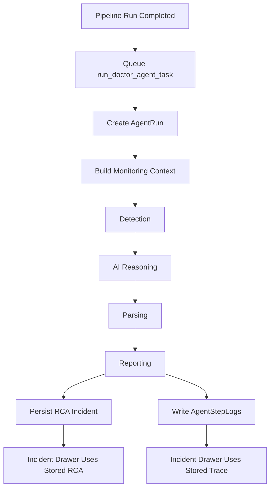
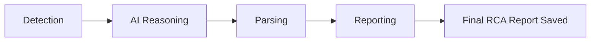
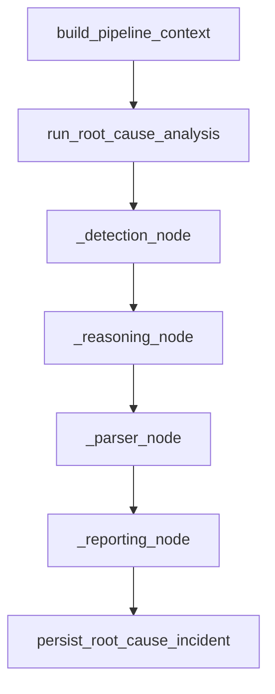
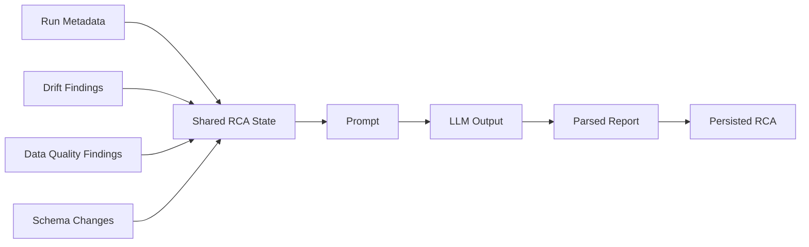

# AI Orchestration (LangGraph RCA)

This document explains the current AI root cause analysis system.

The goal of the orchestration layer is to convert failed monitoring evidence into a structured RCA report that users can read directly in the incident drawer.

The important runtime rule now is:

- the main validation pipeline does **not** persist RCA directly
- it queues the doctor agent task
- the doctor agent task runs the 4-step RCA flow, writes `agent_runs` / `agent_step_logs`, and then persists the final RCA incident report

---

## Orchestration Diagram



### What This Diagram Means

- RCA starts only after the normal monitoring pipeline finishes.
- The doctor task is the single execution owner for new RCA runs.
- `AgentRun` and `AgentStepLog` are created before and during RCA execution.
- The final RCA incident is only persisted in the reporting step, so report and trace stay aligned.

---

## What It Does

For a monitored pipeline run, the AI layer:

1. loads drift, schema, and data quality evidence
2. asks the RCA model to reason about the likely cause
3. parses the response into a structured report
4. persists the report during the reporting step so trace logs and RCA output stay in sync

---

## Core Files

| File | Responsibility |
|---|---|
| `backend/fastapi/app/services/ai_orchestration/supervisor.py` | Main RCA graph and step definitions |
| `backend/fastapi/app/services/ai/context_builder.py` | Builds run-specific monitoring context |
| `backend/fastapi/app/tasks/ai_tasks.py` | Celery task that executes the doctor agent |
| `backend/fastapi/app/services/incidents/rca_persistence.py` | Persists the final RCA incident payload |
| `backend/fastapi/app/services/ai_orchestration/prompts.py` | RCA prompt builder |
| `backend/fastapi/app/services/ai_orchestration/parser.py` | Structured output parsing |
| `backend/fastapi/app/services/ai_orchestration/llm_client.py` | LLM provider integration |

---

## 4-Step RCA Flow

The orchestration uses these four steps:

1. `Detection`
2. `AI Reasoning`
3. `Parsing`
4. `Reporting`

### Step-by-Step Flow Diagram



### Detection

The system loads:

- data quality findings
- drift findings
- schema changes

These are normalized into `detected_signals`.

### AI Reasoning

The system builds a root-cause prompt and sends it to the configured LLM.

If no live LLM is available, the system falls back to deterministic rule-based reasoning.

### Parsing

The system extracts:

- `failure_types`
- `severity`
- `summary`
- `recommendation`

The parser also guards against under-reporting by comparing parsed severity with detected signal severity and keeping the worse one.

### Reporting

The system creates the final RCA payload and persists it to the incident during the doctor task's reporting step.

That means a completed RCA now has:

- a saved RCA report
- an `AgentRun`
- stored `AgentStepLog` rows

from the same execution flow.

---

## Graph Design

**File:** `backend/fastapi/app/services/ai_orchestration/supervisor.py`

When LangGraph is installed, the RCA flow is built as a graph:

```text
detection -> reasoning -> parser -> reporting -> END
```

If LangGraph is unavailable, the project falls back to a sequential supervisor with the same step order. That keeps RCA available even in simpler environments.

### Internal Execution View



---

## Agent State

The supervisor moves a shared state object across the nodes. It carries:

- run metadata
- model id
- baseline version
- schema change information
- data quality findings
- drift findings
- detected signals
- root-cause prompt
- model reasoning output
- parsed report fields
- final RCA report

This shared state is what makes the graph deterministic and debuggable.

### State Movement Diagram



---

## Output Shape

The reporting step creates a payload like:

```json
{
  "title": "AI Root Cause Analysis",
  "run_id": 10,
  "failure_types": ["RANGE_VIOLATION", "EXTRA_COLUMNS"],
  "severity": "medium",
  "summary": "Pipeline run failed because values moved outside the baseline range and an extra column was present.",
  "recommendation": "Inspect bad rows first and update the baseline only if the upstream change is expected.",
  "issues": [],
  "evidence": []
}
```

This is the report consumed by the incident drawer.

---

## Fallback Behavior

The orchestration is resilient by design:

- no LangGraph -> sequential supervisor
- no LLM -> deterministic RCA fallback
- Redis live publish failure -> main RCA task still completes

That means the RCA system degrades gracefully instead of failing completely.

---

## UI Behavior

The incident drawer now follows the real RCA lifecycle:

1. show the live execution trace
2. show dynamic step messages while the agent is running
3. reveal the final RCA report only after the `Reporting` step finishes

This prevents users from seeing a premature RCA card before persistence is complete.

Because RCA creation is now routed through the doctor task, new incidents should no longer end up with a saved RCA report but no trace logs.

### Important Run Boundary

This guarantee applies to new runs created after the unified doctor-task flow was deployed.

Older runs may still show one of these legacy states:

- RCA summary exists but no `AgentRun`
- RCA report exists but no `AgentStepLog`

That mismatch is historical data, not the intended current design.

---

## Related Docs

- [realtime_tracing.md](./realtime_tracing.md)
- [automation_and_scheduler.md](./automation_and_scheduler.md)
