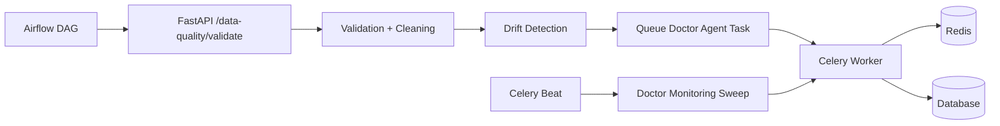
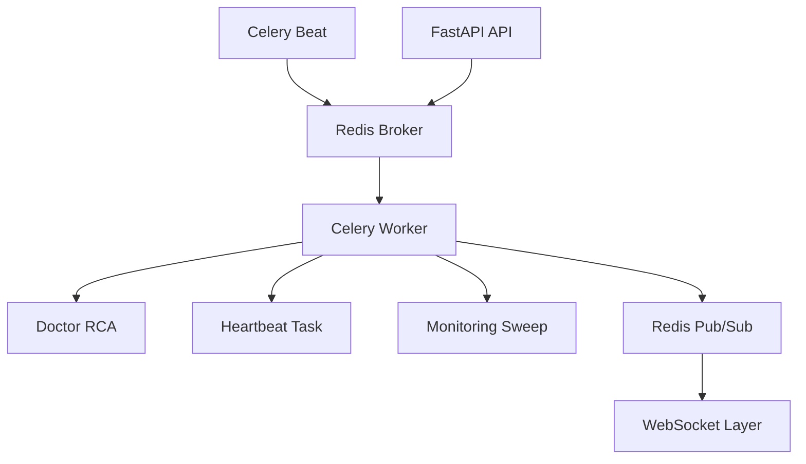
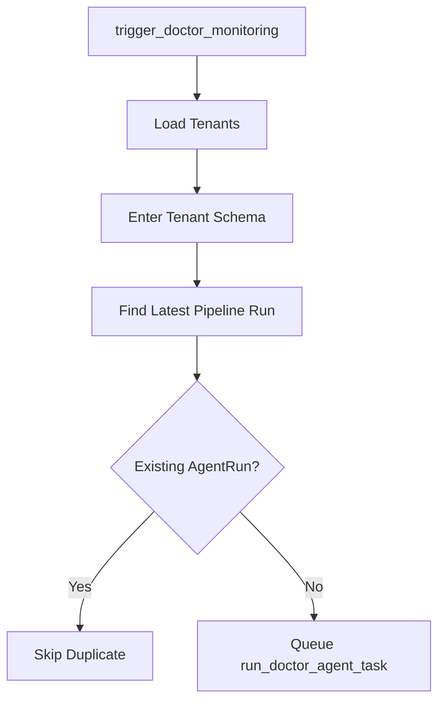
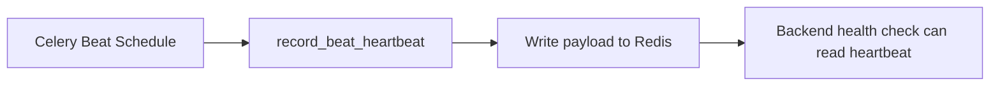
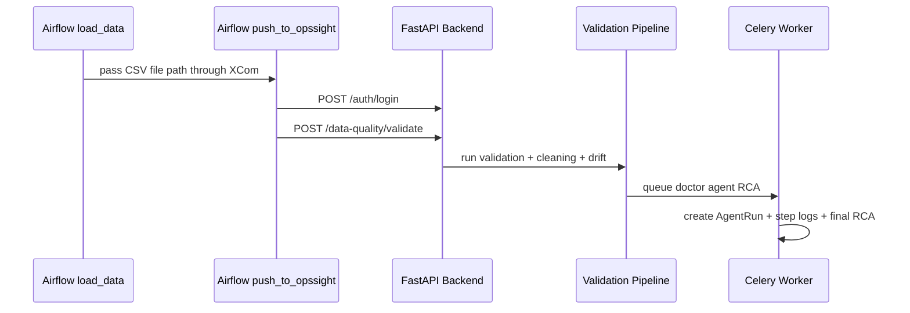

# Automation and Scheduling

This document explains the background automation added this week.

The project now uses Celery, Redis, and Airflow together to keep monitoring and RCA execution automatic.

New RCA creation is now centralized through the doctor task. The main validation pipeline queues the task, and the task itself persists the final RCA incident after writing the trace steps.

---

## Automation Architecture Diagram



### What This Diagram Means

- Airflow is one entry path into the backend.
- The backend pipeline performs deterministic monitoring first.
- Doctor RCA is queued after that monitoring phase.
- Celery Beat also triggers periodic sweeps as a safety automation layer.
- Redis supports queue transport and heartbeat/tracing communication.

---

## What Was Added

- scheduled doctor-agent monitoring sweep
- persistent Celery Beat heartbeat
- doctor RCA execution in background workers
- Redis-backed task and realtime transport
- Airflow ingestion path into the backend
- unified RCA persistence through `run_doctor_agent_task`

---

## Core Files

| File | Responsibility |
|---|---|
| `backend/fastapi/app/tasks/scheduler_tasks.py` | Monitoring sweep and beat heartbeat |
| `backend/fastapi/app/tasks/ai_tasks.py` | Doctor RCA worker task |
| `backend/fastapi/app/core/celery_app.py` | Celery app configuration |
| `airflow-setup/dags/opssight_pipeline_dag.py` | Example Airflow DAG |
| `docker-compose.yml` | Runtime orchestration for API, worker, beat, Redis, MLflow, and Airflow |

---

## Celery Roles

### Celery Worker

Runs:

- RCA doctor agent
- scheduled monitoring jobs
- email jobs

The doctor agent is now responsible for:

- creating `AgentRun`
- writing `AgentStepLog`
- persisting the final RCA incident/report

### Celery Beat

Dispatches:

- `record_beat_heartbeat`
- `trigger_doctor_monitoring`

### Redis

Used for:

- Celery broker
- Celery result backend
- WebSocket Pub/Sub

### Celery + Redis Role Diagram



---

## Doctor Monitoring Sweep

**File:** `backend/fastapi/app/tasks/scheduler_tasks.py`

The periodic doctor-monitoring task:

1. loops through tenants
2. enters each tenant schema
3. finds the latest pipeline run
4. checks whether a doctor `AgentRun` already exists
5. queues `run_doctor_agent_task(...)` only when needed

This avoids duplicate RCA executions for the same latest run.

In addition to the scheduled sweep, the main validation pipeline now also queues the doctor task immediately after drift processing for the current run. That gives new runs a trace-backed RCA without waiting for the next sweep.

### Monitoring Sweep Diagram



---

## Beat Heartbeat

Celery Beat writes a small heartbeat payload into Redis so the backend can verify the scheduler is alive.

Redis key:

`celery:beat:last_heartbeat`

This is useful for operational health checks.

### Heartbeat Flow Diagram



---

## Airflow Integration

The Airflow DAG in `airflow-setup/dags/opssight_pipeline_dag.py`:

1. loads the newest CSV from `airflow-setup/data/`
2. authenticates with the OpsSight backend
3. sends the file to `/data-quality/validate?model_id=...`

### Airflow Execution Diagram



### Request Timeout Behavior

The DAG uses explicit HTTP timeouts so long backend work does not hang forever:

- login request timeout is longer than the old 30-second default
- validate/upload request timeout is longer because validation, drift, and RCA queueing can take noticeably longer

If Airflow cannot finish the backend request in time, the task usually becomes:

- `up_for_retry`

rather than staying permanently running.

---

## Important Auth Rule for Airflow

Airflow must use the **website login credentials**, not the Airflow UI login.

Use:

- `OPSSIGHT_API_EMAIL`
- `OPSSIGHT_API_PASSWORD`

Do not confuse them with:

- Airflow UI login at `localhost:8080`

### Why Static Tokens Fail

The backend access token expires after 30 minutes. That means a manually copied `OPSSIGHT_API_TOKEN` will eventually fail with `401 Unauthorized`.

The DAG now prefers:

1. `POST /auth/login`
2. read the returned `access_token`
3. call `/data-quality/validate?...`

This makes scheduled runs stable across time.

### Common Airflow Failure Pattern

If `push_to_opssight` enters `up_for_retry`, check the Airflow task log first.

Typical reasons:

- backend login request timed out
- backend validate request timed out
- temporary backend or Docker network instability

---

## Docker Runtime Notes

The root `docker-compose.yml` is now the only compose file needed for the backend stack.

It includes:

- FastAPI API
- Celery worker
- Celery beat
- Redis
- MLflow
- Airflow DB
- Airflow init
- Airflow scheduler
- Airflow webserver

The old `airflow-setup/docker-compose.yml` is no longer used.

Frontend still runs separately outside Docker.

### Current Airflow Stability Notes

The root `docker-compose.yml` now includes a lighter Airflow runtime profile to reduce instability in local Docker environments:

- webserver workers reduced to `1`
- scheduler parsing processes reduced to `1`
- SQLAlchemy pre-ping enabled for Airflow DB connections

These changes help avoid stale UI states caused by:

- intermittent `airflow-db` name-resolution failures
- webserver worker OOM kills
- temporary DAG deactivation in the Airflow UI

---

## Daily Startup

Backend stack:

```bash
docker compose up -d
```

Frontend:

```bash
cd frontend
npm run dev
```

---

## Related Docs

- [setup.md](./setup.md)
- [ai_orchestration.md](./ai_orchestration.md)
- [realtime_tracing.md](./realtime_tracing.md)
