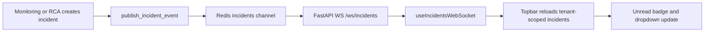

# Notifications

OpsSight notifications are the in-app operational inbox for incident activity. They complement Slack and email alerts, but the incident drawer and production report remain the source of truth for investigation.

---

## What Creates A Notification

A notification appears when a top-level incident run is created or updated. The notification is run-level, not finding-level, so one problematic DAG run should produce one visible alert in the navbar even if the run contains many drift, quality, or schema findings.

---

## Delivery Flow

The WebSocket event is used as a signal. Before showing anything to the user, the frontend refetches incidents through the normal tenant-protected REST API.

---

## Navbar Behavior

- The bell badge shows unread incident count for the current tenant and user.
- Opening the dropdown shows recent incidents with severity, status, model/run context, and created time.
- Read state is stored locally per tenant/user, so switching workspaces does not mix notification state.
- The dropdown can show Slack and email delivery context so the user understands which external alert paths are configured.
- Clicking an incident should take the user back to the incident details workflow.

---

## Instant Updates And Fallback

The primary path is WebSocket-based. When `incident_created` or `incident_updated` arrives, the navbar refreshes immediately.

There is also a periodic polling fallback. This is useful during local development, browser sleep/wake cycles, and transient WebSocket reconnects, but production should treat the WebSocket path as the real-time source.

---

## Relationship To Slack And Email

- In-app notification: available to logged-in users inside OpsSight.
- Slack alert: requires the tenant to connect a Slack workspace and select a default channel.
- Email alert: depends on the configured mail provider and recipient policy.

Slack or email delivery failure should not hide the in-app notification. The incident should still be visible in OpsSight.

---

## Production Hardening

The UI currently renders tenant-safe data because it refetches incidents through authenticated tenant-scoped APIs. For public multi-tenant production, the WebSocket transport should also be tenant-scoped before event payloads reach the browser.

Recommended production setup:

- Authenticate the WebSocket with a short-lived access token or session-bound token.
- Resolve the tenant on the server before subscribing to events.
- Use tenant-scoped Redis channels such as `incidents:{tenant_id}` or filter events server-side.
- Avoid sending raw cross-tenant incident payloads over a shared browser socket.
- Keep the polling fallback tenant-scoped through the same REST authorization rules.

---

## Verification Checklist

1. Open the app and confirm the WebSocket connects to `/ws/incidents`.
2. Trigger a DAG run that creates an incident.
3. Confirm the navbar bell count updates without refreshing the page.
4. Open the notification dropdown and confirm the new incident appears.
5. Confirm the incidents page and drawer still show the same run-level incident.
6. Refresh the browser and confirm read/unread state remains scoped to the current tenant/user.

---

## Related Files

- `frontend/src/components/layout/Topbar.jsx`
- `frontend/src/hooks/useIncidentsWebSocket.js`
- `backend/fastapi/app/api/routes/agent_trace.py`
- `backend/fastapi/app/services/incidents/live_events.py`
