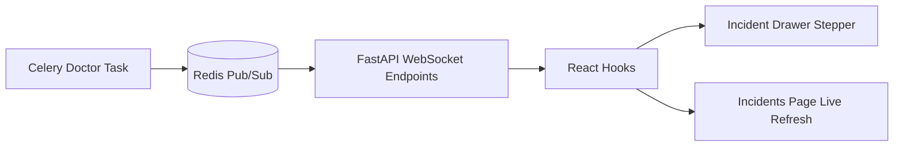
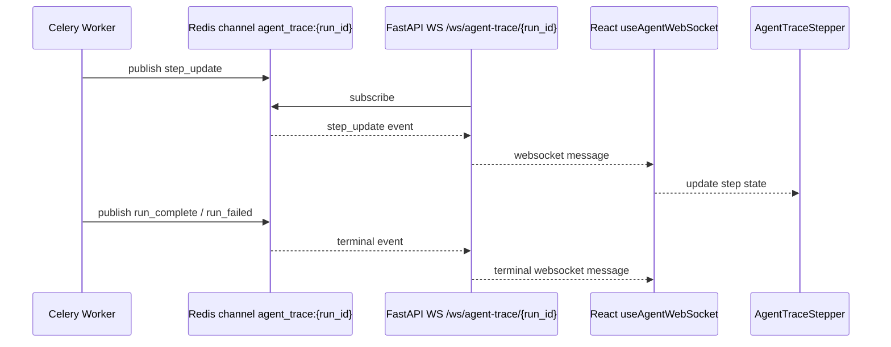
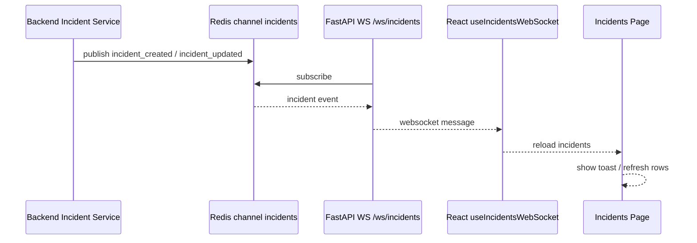
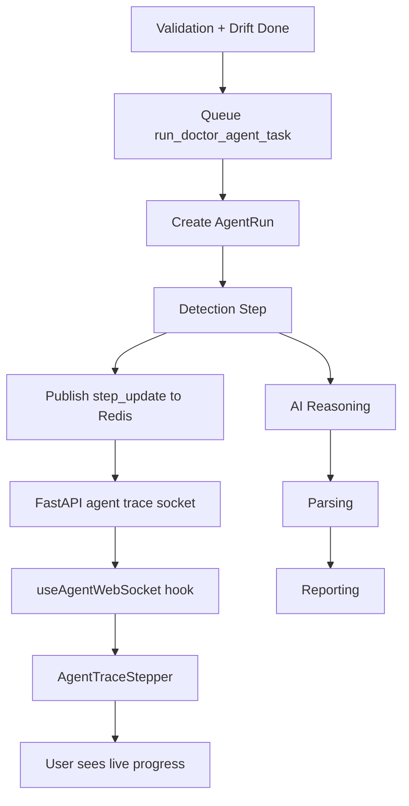
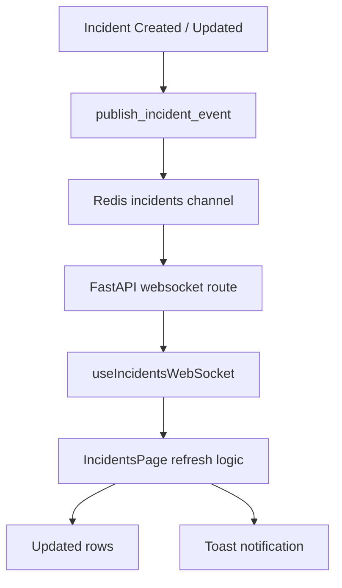

# Realtime Tracing (WebSockets + Live Incident Updates)

This document explains the realtime features added this week.

The project now supports:

- live RCA step updates while the doctor agent runs
- automatic incident page refresh when incidents are created or updated

The doctor task is now the single source of RCA creation for new runs, so the saved RCA report and the live trace come from the same flow.

---

## Realtime Architecture Diagram



### What This Diagram Means

- Celery produces live execution events.
- Redis is used as the realtime bridge.
- FastAPI subscribes to Redis and forwards events through WebSockets.
- React listens through hooks and updates the UI immediately.

---

## Why This Exists

Without realtime updates:

- users had to refresh the incidents page manually
- the RCA drawer could only show stored logs after the run finished

Now the UI can show:

- "System is detecting..."
- "System is reasoning..."
- "System is parsing..."
- "System is finalizing and saving the RCA report..."

and only show the final RCA card when reporting is done.

---

## Core Files

| File | Responsibility |
|---|---|
| `backend/fastapi/app/api/routes/agent_trace.py` | WebSocket endpoints |
| `backend/fastapi/app/services/websocket/connection_manager.py` | Connection management |
| `backend/fastapi/app/services/incidents/live_events.py` | Redis incident publish helper |
| `backend/fastapi/app/tasks/ai_tasks.py` | Step event publishing |
| `frontend/src/hooks/useAgentWebSocket.js` | Live RCA trace hook |
| `frontend/src/hooks/useIncidentsWebSocket.js` | Live incident feed hook |
| `frontend/src/components/agents/AgentTraceStepper.jsx` | Live stepper UI |
| `frontend/src/pages/incidents/IncidentsPage.jsx` | Drawer behavior and event handling |

---

## WebSocket Endpoints

### Agent Trace

`WS /ws/agent-trace/{run_id}`

Used by the incident drawer to watch one RCA execution.

**Event types**

- `connected`
- `ping`
- `step_update`
- `run_complete`
- `run_failed`

### Agent Trace WebSocket Flow



### Incidents Feed

`WS /ws/incidents`

Used by the incidents page to react to incident changes.

**Event types**

- `connected`
- `ping`
- `incident_created`
- `incident_updated`

### Incident Feed WebSocket Flow



---

## Redis Channels

Redis acts as the bridge between Celery workers and WebSocket clients.

| Channel | Purpose |
|---|---|
| `agent_trace:{run_id}` | Live RCA step updates for one run |
| `incidents` | Shared incident update feed |

This is important because Celery and FastAPI do not share memory. Redis carries the live events between them.

---

## Live RCA Step Flow

```text
Validation and drift finish
        |
Queue run_doctor_agent_task(...)
        |
Celery doctor task starts
        |
Publish step_update to Redis
        |
FastAPI WebSocket listens on agent_trace:{run_id}
        |
Frontend hook receives event
        |
AgentTraceStepper updates live
```

### Detailed RCA Trace Pipeline



### Step Names

| Step Index | Name |
|---|---|
| `0` | `detection` |
| `1` | `reasoning` |
| `2` | `parser` |
| `3` | `reporting` |

---

## Incident Feed Flow

```text
Incident is created or updated
        |
publish_incident_event(...)
        |
Redis channel "incidents"
        |
FastAPI WebSocket forwards event
        |
Incidents page silently reloads data
        |
UI updates and can show toast notifications
```

### Detailed Incident Refresh Pipeline



---

## Current Drawer Rules

### RCA Visibility

The drawer does not show the `AI Root Cause Analysis` card immediately when `rca_report` exists in incident data.

It now waits until:

- the reporting step is `done`, or
- the stored agent run clearly finished reporting

For older runs created before the unified doctor-task flow, a saved RCA report may still exist without any trace logs. New runs should not have that mismatch.

### Dynamic Step Messaging

While the run is live, the stepper uses dynamic action text for each step instead of static descriptions.

Examples:

- `System is detecting drift, schema, and data quality signals.`
- `System is reasoning over the detected failure signals.`
- `System is parsing the AI response into structured RCA fields.`
- `System is finalizing and saving the RCA report.`

---

## Frontend Control Flow

The incident drawer does this:

1. fetch incident list
2. fetch agent runs for the selected incident
3. fetch stored step logs for the latest agent run
4. connect to `/ws/agent-trace/{run_id}` if the run is still running
5. switch from stored view to live stepper when frames arrive
6. reveal the RCA card only after reporting completes

The incidents page separately opens `/ws/incidents` to auto-refresh incident rows.

---

## Debug Checklist

If live trace is not working:

1. confirm the latest agent run is `running`
2. confirm `/ws/agent-trace/{run_id}` appears in browser Network > Socket
3. confirm `step_update` frames arrive
4. confirm the stepper changes in the drawer

If the incident drawer shows RCA summary but no trace:

1. check `GET /incidents/{incident_id}/agent-runs`
2. check backend API logs for doctor-task queueing errors
3. check whether the run was created before the unified doctor-task flow

One important queueing error seen during development was:

- `Tenant id could not be resolved for the doctor agent task`

When that happened, the incident could still exist, but no `AgentRun` was created.

If incident auto-refresh is not working:

1. confirm `/ws/incidents` appears in browser Network > Socket
2. confirm Redis publish is happening
3. confirm the frontend reloads incidents on `incident_created` / `incident_updated`

If the incident drawer looks stuck on an old Airflow run state:

1. check the Airflow task log, not only the graph color
2. confirm whether the task actually ended `success`, `failed`, or `up_for_retry`
3. remember that Airflow UI can look stale when the DAG is temporarily deactivated by scheduler instability

---

## Related Docs

- [ai_orchestration.md](./ai_orchestration.md)
- [automation_and_scheduler.md](./automation_and_scheduler.md)
