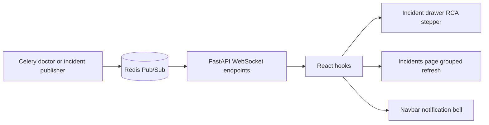

# Realtime Tracing

PipelineDoctor uses WebSockets plus Redis Pub/Sub for two live experiences:

- live RCA step updates while the doctor agent is running
- live grouped-incident refresh on the incidents page
- live navbar notification updates when incident events are published

---

## Current Realtime Architecture

---

## Endpoints

### `WS /ws/agent-trace/{run_id}`

Used by the incident drawer to stream live RCA execution for a run.

Common event types:

- `connected`
- `ping`
- `step_update`
- `run_complete`
- `run_failed`

### `WS /ws/incidents`

Used by the incidents page and topbar notification bell to refresh when incidents are created or updated.

Common event types:

- `connected`
- `ping`
- `incident_created`
- `incident_updated`

---

## Current UI Behavior

### Agent trace

The drawer:

1. loads stored `agent_runs`
2. loads stored `agent_step_logs`
3. connects to `WS /ws/agent-trace/{run_id}` when the run is still active
4. shows live progress until reporting finishes
5. reveals the final RCA card only after reporting is complete

### Incidents page

The incidents page:

1. loads grouped top-level incidents
2. connects to `WS /ws/incidents`
3. refreshes the grouped incident list when live events arrive
4. fetches children separately when the drawer opens

### Navbar notifications

The topbar:

1. connects to `WS /ws/incidents` when the app shell loads
2. ignores heartbeat frames such as `connected` and `ping`
3. reacts to `incident_created` and `incident_updated`
4. refetches tenant-scoped incidents through REST before rendering details
5. updates unread count and recent notification dropdown
6. falls back to periodic refresh when the socket is unavailable

---

## Reliability Notes

Recent hardening changed two important runtime behaviors:

- the incident WebSocket hook now reconnects after unexpected socket closure
- the incident list is centered on run-level grouped alerts, not every raw child incident
- notification read state is scoped by tenant/user in browser storage
- polling fallback is useful for resilience, but WebSocket delivery is the primary real-time path

---

## Production Hardening

For local development, `/ws/incidents` can subscribe to the shared Redis `incidents` channel. For multi-tenant production, the transport should be tenant-aware before events reach the browser.

Recommended setup:

- authenticate the socket using a short-lived user/session token
- resolve `tenant_id` on the server
- subscribe to tenant-specific Redis channels, for example `incidents:{tenant_id}`
- or filter events server-side before sending them over the socket
- keep REST refetches tenant-scoped as the final authorization boundary

---

## Related Files

- `backend/fastapi/app/api/routes/agent_trace.py`
- `backend/fastapi/app/services/websocket/connection_manager.py`
- `backend/fastapi/app/services/incidents/live_events.py`
- `frontend/src/hooks/useAgentWebSocket.js`
- `frontend/src/hooks/useIncidentsWebSocket.js`
- `frontend/src/components/layout/Topbar.jsx`
- `frontend/src/pages/incidents/IncidentsPage.jsx`
